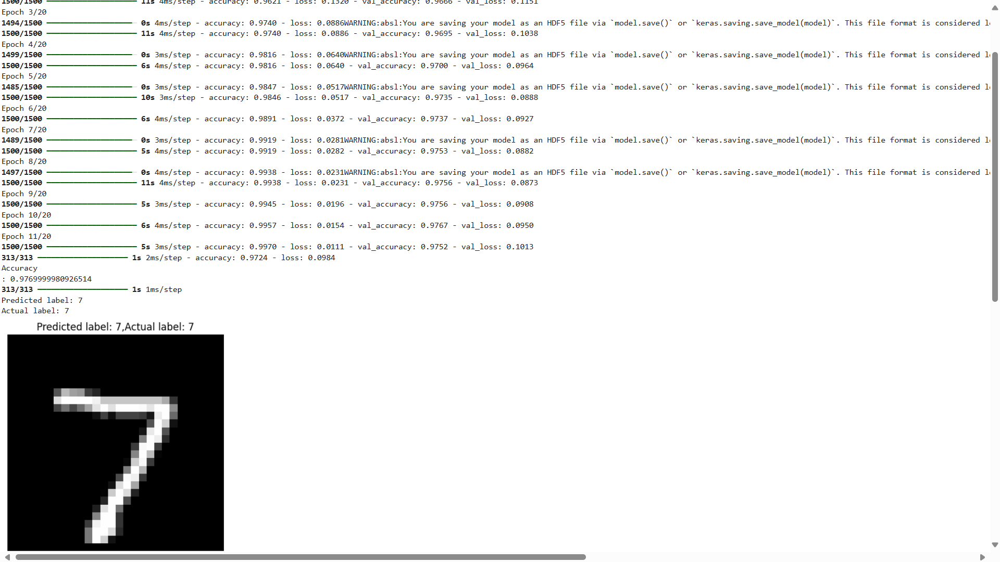

# Handwritten-Digit-Recognition-using-TensorFlow-with-Callbacks-Performance-Tracking
A handwritten digit classification model using TensorFlow and the MNIST dataset. Includes callbacks, performance visualization, and model saving for real-world ML practice.

# 🧠 MNIST Digit Classifier with TensorFlow

A simple yet powerful deep learning model to classify handwritten digits (0–9) using the MNIST dataset. This project includes model training, evaluation, early stopping, checkpoint saving, and performance visualization.


## 🚀 Features

- Achieves ~97.7% accuracy on test data  
- Uses `EarlyStopping` and `ModelCheckpoint` for optimal training  
- Visualizes training/validation accuracy and loss  
- Displays prediction results with matplotlib


## 🗂️ Dataset

- **MNIST**: 60,000 training images and 10,000 test images of handwritten digits  
- Loaded directly using:  
  ```python
  tf.keras.datasets.mnist.load_data()
  ```


## 🧱 Model Architecture

- **Input Layer**: Flatten 28x28 image to 784 units  
- **Hidden Layer**: Dense(128) with ReLU activation  
- **Output Layer**: Dense(10) with Softmax activation


## 🛠️ Tech Stack

- Python 3  
- TensorFlow / Keras  
- NumPy  
- Matplotlib  


## 📊 Training Visualization

Training and validation performance are plotted over epochs:

- Accuracy over Epochs  
- Loss over Epochs  


## 🖼️ Sample Prediction Output

- Displays the test image alongside predicted and actual labels for easy visual verification


## 💾 Model Saving & Loading

- Model saved using:
  ```python
  model.save("mnist_model.h5")
  ```

- Model loaded and evaluated later with:
  ```python
  model = tf.keras.models.load_model("mnist_model.h5")
  ```


## 📌 Usage

1. Clone the repo or copy the code into your local environment or Colab  
2. Run the notebook or script  
3. Visualize training metrics and predictions  
4. Modify and improve!


## ✨ Result

> 📈 Achieved ~97.7% accuracy on unseen test data.


## 📸 Sample Prediction Output

Here’s how the model visualizes predictions:


<p align="center">
  
</p>


## 📚 License

This project is open-source and free to use for educational purposes.


## 👨‍💻 Author

- Aman Singh 
  (Bachelor of Science in Computer Science | AI/ML Enthusiast)
